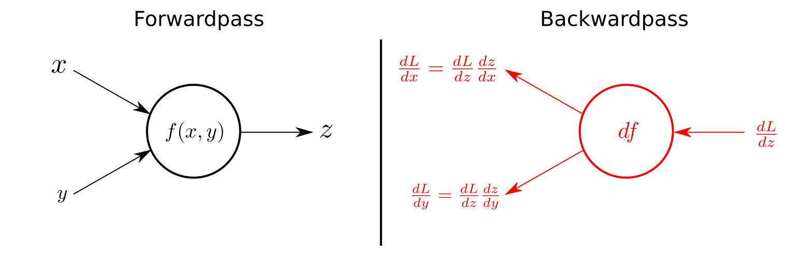

## 1. pytorch

DBG(Define by run) 방식의 프레임워크  
tensorflow(1.x)와 달리 실행 시간에 그래프가 생성됨

## 2. torch

pytorch에서 사용하는 numpy 형식의 데이터(tensor) 제공  
backpropagation 과정에서 자동미분을 제공함  
다양한 기능을 가진 함수와 모델 제공  

## 3. tensor

numpy와 비슷한 형태의 데이터 비슷한 원리로 생성 및 사용이 가능하다

```python
   a_numpy = np.array([1,2,3,4])
   a_tensor_from_numpy = torch.from_numpy(a_numpy)
   a_tensor = torch.Tensor([1,2,3,4])
```

기본적으로 numpy와 비슷한 형태의 인덱싱이 가능하다

```python
   data = [[1,2,3],[4,5,6],[7,8,9]]
   tensor_from_data=torch.from_numpy(data)
   data[:,0]
   #array([[1],[4],[7]],dtype=int64)
   tensor_from_data[:,0]
   #tensor([[1],[4],[7]])
```

torch는 gpu에 올려서 gpu를 사용가능하다

```python
    if torch.cuda.is_available():
       data_cuda = tensor_from_data.to('cuda')
    x_data_cuda.device
   # device(type = 'cuda', index = 0)
```

## 4. tensor operations  

### tensor의 인덱싱
```python
    tensor_ex = torch.rand(size=(2, 3, 2))
    tensor_ex
    # tensor([[[0.7466, 0.5440],
    # [0.7145, 0.2119],
    # [0.8279, 0.0697]],
    # [[0.8323, 0.2671],
    # [0.2484, 0.8983],
    # [0.3228, 0.2254]]])
    tensor_ex.view([-1, 6])
    # tensor([[0.7466, 0.5440, 0.7145, 0.2119, 0.8279, 0.0697],
    # [0.8323, 0.2671, 0.2484, 0.8983, 0.3228, 0.2254]])
    tensor_ex.reshape([-1,6])
    # tensor([[0.7466, 0.5440, 0.7145, 0.2119, 0.8279, 0.0697],
    # [0.8323, 0.2671, 0.2484, 0.8983, 0.3228, 0.2254]])
```

### view, reshape ,squeeze, unsqueeze  
결과가 같아 보이지만  
view는 원래의 메모리 공간을 공유하고(원본이 바뀌면 자신도 바뀜)  
reshape는 새로운 텐서를 생성한다는 차이가 있다  
squeeze는 크기가 1인 차원을 제거
unsqueeze는 크기가 1인 차원을 인풋으로 준 위치에 추가한다
```python
    tensor_ex = torch.rand(size=(2, 1, 2))
    tensor_ex.squeeze()
    # tensor([[0.8510, 0.8263],
    # [0.7602, 0.1309]])
    tensor_ex = torch.rand(size=(2, 2))
    tensor_ex.unsqueeze(0).shape
    # torch.Size([1, 2, 2])
    tensor_ex.unsqueeze(1).shape
    # torch.Size([2, 1, 2])
    tensor_ex.unsqueeze(2).shape
    # torch.Size([2, 2, 1]) 
```
### 텐서 연산
기본적인 연산은 numpy와 동일하고 마찬가지로 broadcasting을 제공한다
그러나 행렬 곱셈에서 dot 대신 mm(matrix multiplication)을 쓴다 

```python
    n2 = np.arange(10).reshape(5,2)
    t2 = torch.FloatTensor(n2)
    t1.mm(t2)
    # tensor([[ 60., 70.],
    # [160., 195.]])
    t1.dot(t2)
    # RuntimeError
    t1.matmul(t2)
    # tensor([[ 60., 70.],
    # [160., 195.]])
    a = torch.rand(10)
    b = torch.rand(10)
    a.dot(b)
    a = torch.rand(10)
    b = torch.rand(10)
    a.mm(b)
```

## 4. autograd

텐서의backward 함수를 사용하여 텐서의 그레디언트를 계산할 수 있다.

```python
    a = torch.tensor([2., 3.], requires_grad=True)
    b = torch.tensor([6., 4.], requires_grad=True)
    Q = 3*a**3 - b**2
    external_grad = torch.tensor([1., 1.])
    Q.backward(gradient=external_grad)
    a.grad
    # a.grad
    b.grad
    # tensor([-12., -8.])
```
## 5. torch.nn.Module

pytorch module의 베이스 클래스가 되는 모듈로 input,output을 정의하고  
forward, backward를 정의하여 모델의 output를 계산하고 parameter들의 gradient를 계산할 수 있다.

이미지 출처 네이버_커넥트  

```python
    class MyLiner(nn.Module):
        def __init__(self, in_features, out_features, bias=True):
            super().__init__()
            self.in_features = in_features
            self.out_features = out_features
            self.weights = nn.Parameter(
            torch.randn(in_features, out_features))
            self.bias = nn.Parameter(torch.randn(out_features))
        def forward(self, x : Tensor):
            return x @ self.weights + self.bias
```
위 코드와 같이 forward 계산시 weight와 bias, x를 이용해 output 텐서를 생성한다
for epoch in range(epochs):


```python
    ……
    # Clear gradient buffers because we don't want any gradient from previous epoch to 
    carry forward
    optimizer.zero_grad()
    # get output from the model, given the inputs
    outputs = model(inputs)
    # get loss for the predicted output
    loss = criterion(outputs, labels)
    print(loss)
    # get gradients w.r.t to parameters
    loss.backward()
    # update parameters
    optimizer.step()
    ………
```
위와 같이 backward 사용시 loss를 구성하는데 들어간 parameter들(weight,bias 들의 gradient가 계산된다)

## 6. dataset 클래스

python에서 데이터를 어떻게 저장하고  
어떻게 전처리하고  
어떻게 사용할지를 정의하는 클래스

```python
import torch
from torch.utils.data import Dataset
class CustomDataset(Dataset):
    def __init__(self, text, labels):
        self.labels = labels
        self.data = text
    def __len__(self):
        return len(self.labels)
    def __getitem__(self, idx):
        label = self.labels[idx]
        text = self.data[idx]
        sample = {"Text": text, "Class": label}
        return sample
```

Dataset 클래스를 상속받아 새로운 커스텀 데이터셋 클래스를 만들 때  
위 처럼 __init__ : 데이터 저장 형태 및 전처리  
__len__ : 데이터셋의 크기 정의  
__getitem__ : 특정 인덱스를 인풋으로 받으면 리턴하는 데이터의 형식을 정의(subscripable 클래스로 만들어줌)  
3개의 멤버함수를 반드시 정의해 주어야 한다.

## 7. Dataloader 클래스

실제 학습할 때 dataset에서 데이터를 어떻게 로딩할지 정의하는 클래스

```python
    text = ['Happy', 'Amazing', 'Sad', 'Unhapy', 'Glum']
    labels = ['Positive', 'Positive', 'Negative', 'Negative', 'Negative']
    MyDataset = CustomDataset(text, labels)
    MyDataLoader = DataLoader(MyDataset, batch_size=2, shuffle=True)
    next(iter(MyDataLoader)) #데이터를 generater로 만들어 순차적으로 다음 데이터에 접근해게 해준다.
    # {'Text': ['Glum', 'Sad'], 'Class': ['Negative', 'Negative']}
    MyDataLoader = DataLoader(MyDataset, batch_size=2, shuffle=True)
    for dataset in MyDataLoader:
    print(dataset)
    # {'Text': ['Glum', 'Unhapy'], 'Class': ['Negative', 'Negative']}
    # {'Text': ['Sad', 'Amazing'], 'Class': ['Negative', 'Positive']}
    # {'Text': ['Happy'], 'Class': ['Positive']}
```
데이터 로더 클래스는 다음과 같이 사용한다.  
  
```python
    DataLoader(dataset, batch_size=1, shuffle=False, sampler=None,
    batch_sampler=None, num_workers=0, collate_fn=None,
    pin_memory=False, drop_last=False, timeout=0,
    worker_init_fn=None,
    *
    , prefetch_factor=2,
    persistent_workers=False)
```
dataset : 사용하는 dataset object  

batch_size : stochastic gradient decent에서 사용할 미니배치 크기  

suffle : 데이터를 무작위 순서로 섞어줌 False이면 dataset에 저장된 순서대로 나온다  

sampler : 데이터를 샘플링 하는 함수 정의  

batch_sampler : 배치 단위로 샘플링 하는 함수 정의  

num_workers : 데이터를 로딩하는 스레드의 수 정의  

collate_fn :  
데이터를 [데이터1, 데이터2, ....], [라벨1, 라벨2,....]가 아닌  
[데이터1, 라벨1],[데이터2, 라벨2] 형식으로 만들 때 사용하는 함수  

pin_memory : 데이터를 page in ,page out이 불가능한 메모리 영역에 맵핑하여 불필요한 I/O를 줄이는 옵션(메모리가 많은 컴퓨터에서나 쓸듯하다)  

drop_last : 크기가 다른 마지막 배치를 버림  
ex) 100개의 데이터가 있고 batch size가 7 이변 크기가 7인 배치가 14개 2인 배치가 1개 생기는데 배치 크기 차이로 오류가 생기는 경우 마지막 배치를 버릴 수 있는 옵션  

timeout :  데이터로딩에 걸리는 시간이 지정된 값 이상이면 중단한다 0이면 중단하지 않음  

worker_init_fn : 워커가 실행할 함수 정의  

오늘 몸무게 91.8 kg 힘내자!!