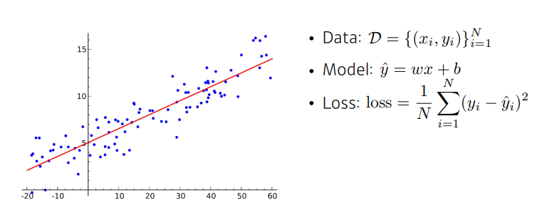
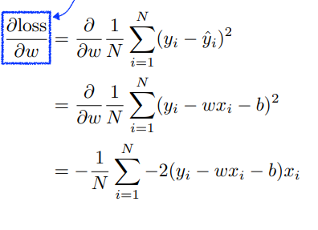
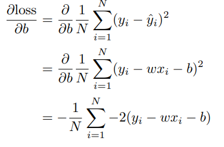
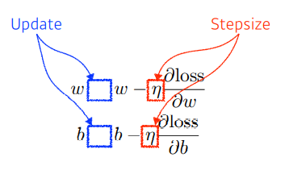
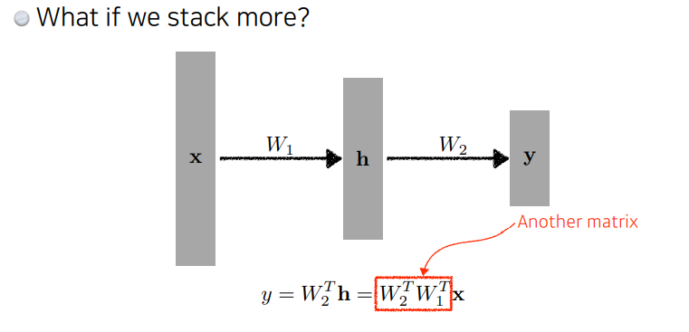
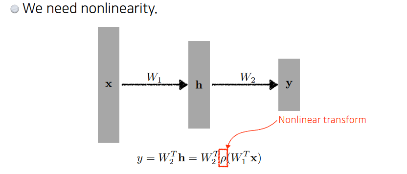
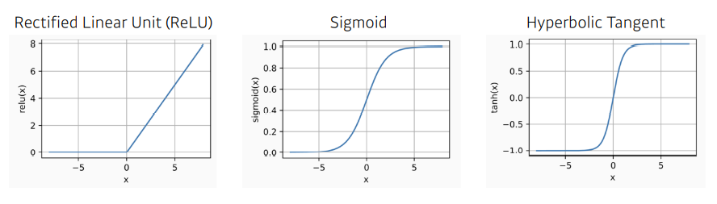
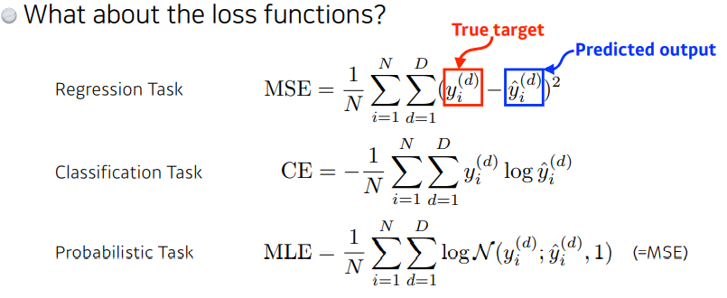

# 딥러닝 기본 2강 MLP

### 뉴럴 네트워크의 정의

#### 사전적 정의

Neural networks are computing sytstems vaguely inspired by the biological neural networks that costitute animal brains(동물의 뇌를 모방한 컴퓨팅 시스템)

#### 딥러닝에서의 정의

Neural networks are function approximator that stack affine transformations followed by nonlinear transformation(아핀 변환과 비선형 변환의 반복으로 구성된 함수를 추정하는 기술)

### 선형 뉴럴 네트워크

위와 같은 선형 회귀 문제는

### 비선형 뉴럴 네트워크

만약 위 그림과 같이 선형 뉴럴 네트워크 2개를 사용한다면 하나의 선형 뉴럴 네트워크를 사용하는 것과 같다. 그리고 선형 함수에 대해서만 근사가 가능하다.

따라서 위와 같이 비선형 변환을 해 주어야 한다.

비선형 activation 함수는 위와 같은 것들을 사용할 수 있지만 sigmoid와 tanh는 gradient vanishing 문제가 있어서 특정 범위의 값이 필요할 때만 사용한다.

목적에 따라 다양한 loss 함수를 사용할 수 있는데 mse는 회귀문제에서 주로 사용하고 ce는 분류문제

probabilistic task는 주로 생성 모델에 많이 사용하는 것으로 보인다.
