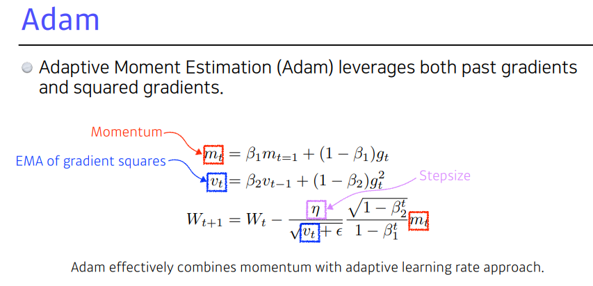

# 딥러닝 기본 2강 optimization

#### 

### Gradient desent : 경사하강법

반복적인 1차 최적화 방법을 사용하여 미분가능한 함수의 극소점을 찾는것(global minimum이 아니라 local minimum이다)

### 최적화를 위한 기법들

Generalization : AI 모델이 이전에 학습하지 않은 데이터들에 대해서도 잘 작동하도록 일부러 모델의 학습을 방해하는 기법

위와 같이 모델을 과하게 학습시키면 한번도 학습하지 않은 데이터들에 대해 성능이 떨어지는 경항이 있다.

모델의 학습 정도에 따라 위의 3가지로 분류할 수 있는데 underfitting은 모델의 파라미터가 너무 적어 학습이 제대로 되지 않은 경우이고 balanced는 적절히 학습된 것 Overfitting은 모델이 학습 데이터셋에 비해 너무 커서 과도하게 학습된 데이터들에 대해서만 성능이 높고 나머지 데이터들에 대해서는 성능이 낮은 현상이다.

데이터를 단순히 train,test로 나누는 것이 아니라 train 데이터를 여러개의 fold로 나누어 각각 한 fold를 학습의 epoch 마다 validation data로 사용하는 model들을 학습시킨 후 각각의 모델들의 결과값의 최빈값 혹은 평균값을 사용하는 기법이다.

모델의 error는 위의 그림과 같이 값이 특정 방향으로 편향된 bias와 모델의 값이 모이지 않고 분산된 정도를 나타내는 variance 또 줄일 수 없는 에러인 noise로 나눌 수 있다. 모델을 과학습시키는 것은 variance는 줄이지만 bias는 높이게 되는 것으로 해석할 수 있다. 일반적으로 bias와 variance는 동시에 줄일 수 없다. 따라서 타협이 필요하다. 

bagging은 학습 데이터들에 대해서 여러개의 샘플을 생성한 뒤 각각의 모델의 결과값을 합쳐서 사용하는 것이고.

boosting은 이전에 학습시킨 모델이 잘 예측하지 못하는 데이터에 대해 다시 학습시켜 점진적으로 성능을 높이는 기법이다.

경사하강법은 크게 3가지로 나눌 수 있는데 

SGD (stochastic gradient descent(확률론적 경사 하강법)) : 

1개의 샘플을 이용하여 gradient를 구한 후 업데이트하여 모델을 학습시키는 방법

minibatch gradient descent : 데이터셋의 부분집합을 이용하여 모델을 학습시키는 방법

batch gradient descent : 데이터 전체를 한번에 학습시키는 방법

일반적으로 딥러닝에서는 SGD가 batch gradient descent 보다 성능이 높은데 그 이유는

위의 그림에서 stocastic gradient descent는 Flat minimun batch gradient descent는 sharp minimum에 도달할 가능성이 높다고 한다. flat minimum의 경우 모델의 파라미터가 값이 조금 변해서 모델의 성능의 차이가 적기에 안정된 학습이 가능하다. 그러나 수렴속도가 매우 느리기 때문에 타협안인 minibatch gradient descent를 주로 사용한다.

### Gradient Descent Methods

단순한 gradient descent 외에 여러가지 방법이 존재한다.

이전에 학습의 방향(momentum)을 어느정도 유지하도록 하는 학습방법이다.

local minimum 주위에서 진동하지 않고 빠르게 수렴하도록 하는 방법이다

많이 학습된 파라미터는 적게 학습하고 적게 학습한 파라미터는 많이 학습하도록 하는 방법이다.

일반적으로 가장 많이 사용하는 옵티마이저이다. 모멘텀과 adagrad의 아이디어를 합친 방법

### Regularization : 정규화

모델이 과도하게 학습하지 않도록 방해하는 방법

overfitting이 되지 않도록 validation error가 최소가 되는 지점에서 학습을 중단하는 것

parameter들의 값이 너무 커지지 않도록 하는 기법 실제로는 90%정도의 파라미터들이 0에 가까워지도록 만든다고 한다.

현재 ai model들은 recall은 매우 높지만 precision이 그에 비해 낮은 경항성을 보인다. 즉 과도하게 확신하는 경향이 있어서 label이 애매한 data로 일부러 학습시키는 방법이다.

랜덤하게 특정 뉴런의 값을 0으로 만들어서 과하게 학습하지 않도록 하는 기법

특정 minibatch로 인한 bias를 줄이기 위해 batch간 의 값들을 표준편차가 1이고 평균이 0인 분포로 만들어 주는 기법이다.

최근에는 여러 normalization 기법중 group norm을 많이 사용하는 듯하다.
